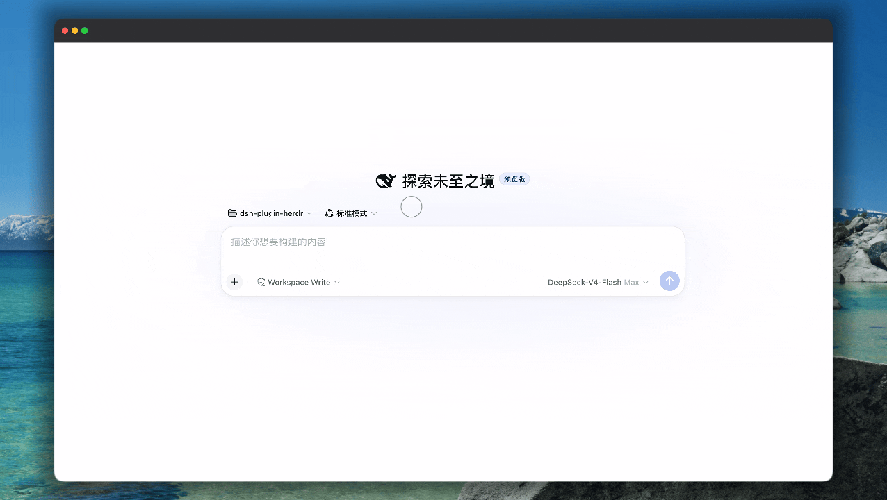

# dsh-plugin-herdr

> **English** | [简体中文](README.zh-CN.md)



Herdr control-plane plugin for [DeepSeek Harness (DSH)](https://github.com/deepseek-ai/deepseek-harness): observe and drive [Herdr](https://herdr.dev) — a terminal workspace manager for AI coding agents — directly from DSH sessions.

## Features

- **Control plane** — 19 `herdr_*` tools over Herdr's Unix-domain socket (snapshot, agents, panes, workspaces, layout, notifications)
- **Session-scoped UI** — Herdr tab and side panel show only the current session's workspace; hidden outside Herdr mode
- **Herdr mode** — create a session in Herdr mode to get a dedicated workspace that lives and dies with the session

## Install

Prerequisites: a DSH profile (e.g. `web`) and a running Herdr server. The plugin talks to the local Herdr socket; the panel can start the server from `PATH` if needed.

```sh
# local directory
dsh plugin --profile web add /path/to/dsh-plugin-herdr

# tarball (pnpm pack output)
pnpm pack
dsh plugin --profile web add ./dsh-plugin-herdr-*.tgz

# git
dsh plugin --profile web add github:sunny0826/dsh-plugin-herdr
```

Restart the profile after install. Verify with `dsh plugin --profile web list`.

## Uninstall

```sh
dsh plugin --profile web remove dsh-plugin-herdr
```

Restart the profile to unload tools, panel, and Herdr mode. The preset copy at `$DSH_HOME/.agent-presets/herdr/` is left behind — remove it manually if needed.

## Development

```sh
pnpm install
pnpm build        # tsdown (node entries + web client bundle)
pnpm quality      # typecheck + gen-types drift check + unit tests
pnpm test         # unit tests (node --test)
pnpm test:integration  # against a live herdr server; SKIPs when unavailable
pnpm gen:types    # regenerate protocol types from the herdr schema fixture
```
